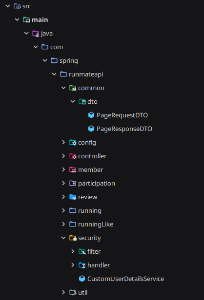

# semi-project-runmate
바쁜 현대사회에서 간단한 런닝 어떠십니까? 운동 부족 사회에서 바로 번개로 소모임 형성
후 지정된 장소에서 크루원 이 모여서 런닝을 시작할 수 있는 런닝 소모임 사이트입니다. 

## 1. 팀원 역할
| 팀원         | 역할       |
|------------|----------|
| 우태식        | `회원 및 리뷰` |
|   육현승           | `러닝 모임 및 러닝 참여` |

## 2. 패키지 구조

## 3. Backend 개발 언어
- IntelliJ
- Spring boot
- JPA
- TOMCAT

## 4. 요구분석 정의서
| 요구사항 구분  | 요구사항명       | 요구사항 상세 설명                                                      | ID      | 비고 |
| -------- | ----------- |-----------------------------------------------------------------|---------| -- |
| 회원 관리    | 회원가입        | 사용자는 아이디, 비밀번호, 닉네임 등의 정보를 입력하여 회원가입할 수 있다.                     | MEM-001 |  |
| 회원 관리    | 로그인         | 회원은 아이디와 비밀번호를 이용하여 로그인할 수 있다.                                  | MEM-002 |  |
| 회원 관리    | 회원정보 조회     | 회원은 자신의 회원정보를 조회할 수 있다.                                         | MEM-003 |  |
| 회원 관리    | 회원정보 수정     | 회원은 자신의 닉네임 등의 회원정보를 수정할 수 있다.                                  | MEM-004 |  |
| 회원 관리    | 회원 탈퇴       | 회원은 자신의 계정을 탈퇴할 수 있다.                                           | MEM-005 |  |
| 관리자 관리    | 회원 목록 조회      | 관리자는 회원 목록을 조회할 수 있다.                                           | ADM-001 |  |
| 관리자 관리    | 회원 상세 조회      | 관리자는 회원 정보를 상세 조회할 수 있다.                                        | ADM-002 |  |
| 러닝 모임 관리 | 러닝 모임 등록    | 로그인한 회원은 러닝 모임의 제목, 장소, 날짜, 시간, 거리, 난이도, 모집 인원 등의 정보를 등록할 수 있다. | RUN-001 |  |
| 러닝 모임 관리 | 러닝 모임 목록 조회 | 사용자는 등록된 러닝 모임 목록을 조회할 수 있다.                                    | RUN-002 |  |
| 러닝 모임 관리 | 러닝 모임 상세 조회 | 사용자는 러닝 모임의 상세 정보와 현재 참가 인원을 조회할 수 있다.                          | RUN-003 |  |
| 러닝 모임 관리 | 러닝 모임 수정    | 모임 작성자는 자신이 등록한 러닝 모임의 정보를 수정할 수 있다.                            | RUN-004 |  |
| 러닝 모임 관리 | 러닝 모임 삭제    | 모임 작성자는 자신이 등록한 러닝 모임을 삭제할 수 있다.                                | RUN-005 |  |
| 러닝 모임 관리 | 모집 상태 관리    | 모집 인원이 마감되거나 러닝 일정이 종료된 경우 모임의 상태를 관리할 수 있다.                    | RUN-006 |  |
| 러닝 참여 관리 | 러닝 참가       | 로그인한 회원은 모집 중인 러닝 모임에 참가할 수 있다.                                 | PAR-001 |  |
| 러닝 참여 관리 | 러닝 참가 취소    | 참가한 회원은 해당 러닝 모임의 참가를 취소할 수 있다.                                 | PAR-002 |  |
| 러닝 참여 관리 | 참가자 조회      | 사용자는 해당 러닝 모임에 참가한 회원 목록을 조회할 수 있다.                             | PAR-003 |  |
| 러닝 참여 관리 | 참가 인원 제한    | 러닝 모임은 설정된 모집 인원을 초과하여 참가할 수 없도록 관리한다.                          | PAR-004 |  |
| 러닝 참여 관리 | 중복 참가 방지    | 동일한 회원이 하나의 러닝 모임에 중복으로 참가할 수 없도록 한다.                           | PAR-005 |  |
| 후기 관리    | 후기 등록       | 러닝 모임에 참가한 회원은 러닝 종료 후 후기를 등록할 수 있다.                            | REV-001 |  |
| 후기 관리    | 후기 조회       | 사용자는 러닝 모임에 등록된 후기를 조회할 수 있다.                                   | REV-002 |  |
| 후기 관리    | 후기 삭제       | 후기를 작성한 회원은 자신의 후기를 삭제할 수 있다.                                   | REV-003 |  |

## 5. REST API 명세서
| 번호 | HTTP Method | 매핑 주소                                                   | 설명             |
|---:| :---------: |---------------------------------------------------------|----------------|
|  1 |     GET     | `/runmate/members`                                      | 관리자 회원조회       |
|  2 |     POST    | `/runmate/members`                                      | 회원가입              |
|  3 |     POST    | `/runmate/members/login`                                | 회원 로그인           |
|  4 |     POST    | `/runmate/members/logout`                               | 회원 로그아웃         |
|  5 |     GET     | `/runmate/members/{memberid}`                           | user 마이페이지 조회  |
|  6 |     GET     | `/runmate/members/{memberid}`                           | admin 마이페이지 조회 |
|  7 |     GET     | `/runmate/members/{memberid}/participation`             | 회원별 참가 목록 조회   |
|  8 |     GET     | `/runmate/members/check-userId`                         | 아이디 중복 확인      |
|  9 |     GET     | `/runmate/members/check-email`                          | 이메일 중복 확인      |
| 10 |     PUT     | `/runmate/members/{memberid}`                           | 마이페이지 수정       |
| 11 |     PUT     | `/runmate/members/{memberid}/role`                      | 관리자 권한 부여      |
| 12 |    DELETE   | `/runmate/members/{memberid}`                           | 회원 탈퇴          |
| 13 |     GET     | `/runmate/runnings`                                     | 러닝 모임 전체 목록 조회 |
| 14 |     POST    | `/runmate/runnings`                                     | 러닝 모임 등록        |
| 15 |     GET     | `/runmate/runnings/{runningId}`                         | 러닝 모임 상세 조회   |
| 16 |     PUT     | `/runmate/runnings/{runningId}`                         | 러닝 모임 수정        |
| 17 |    DELETE   | `/runmate/runnings/{runningId}`                         | 러닝 모임 삭제        |
| 18 |     GET     | `/runmate/runnings/{runningId}/participants`            | 러닝 모임 참가자 조회   |
| 19 |     POST    | `/runmate/runnings/{runningId}/participants`            | 러닝 모임 참가       |
| 20 |    DELETE   | `/runmate/runnings/{runningId}/participants/{memberId}` | 러닝 모임 참가 취소    |
| 21 |     GET     | `/runmate/reviews/{reviewId}`                           | 러닝 모임 후기 상세 조회 |
| 22 |     GET     | `/runmate/reviews/runnings/{runningId}`                 | 러닝 모임별 후기 조회   |
| 23 |     POST    | `/runmate/reviews`                                      | 러닝 모임 후기 등록    |
| 24 |    DELETE   | `/runmate/reviews/{reviewId}`                           | 후기 삭제          |
| 25 |    POST     | `/runmate/runnings/{runningId}/like`                    | 좋아요 토글        |
| 26 |    GET      | `/runmate/runnings/{runningId}/like`                    | 좋아요 여부 조회    |

